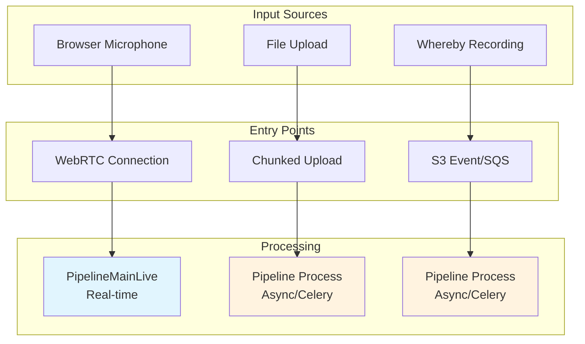
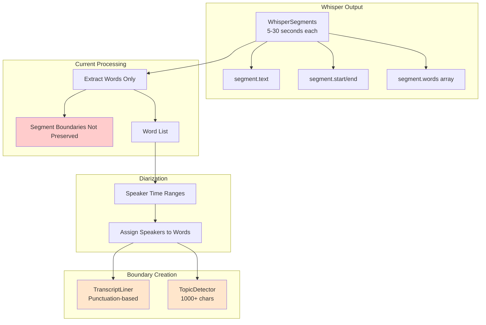
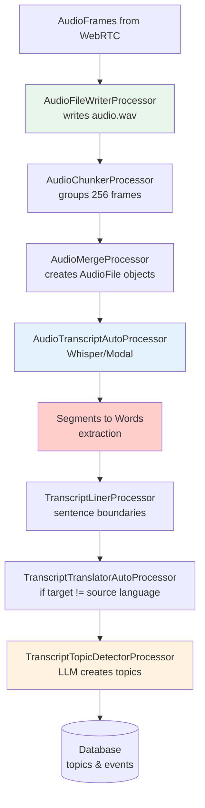
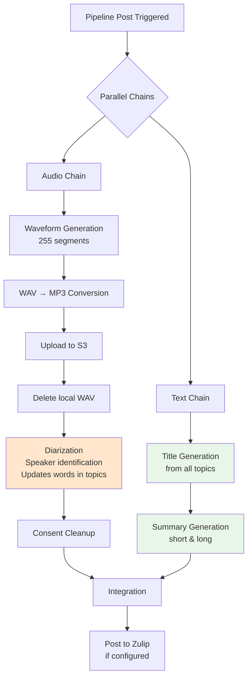
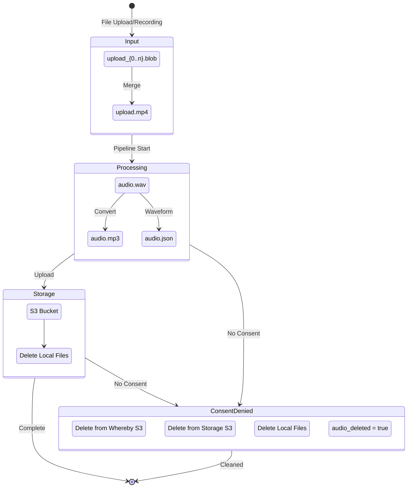
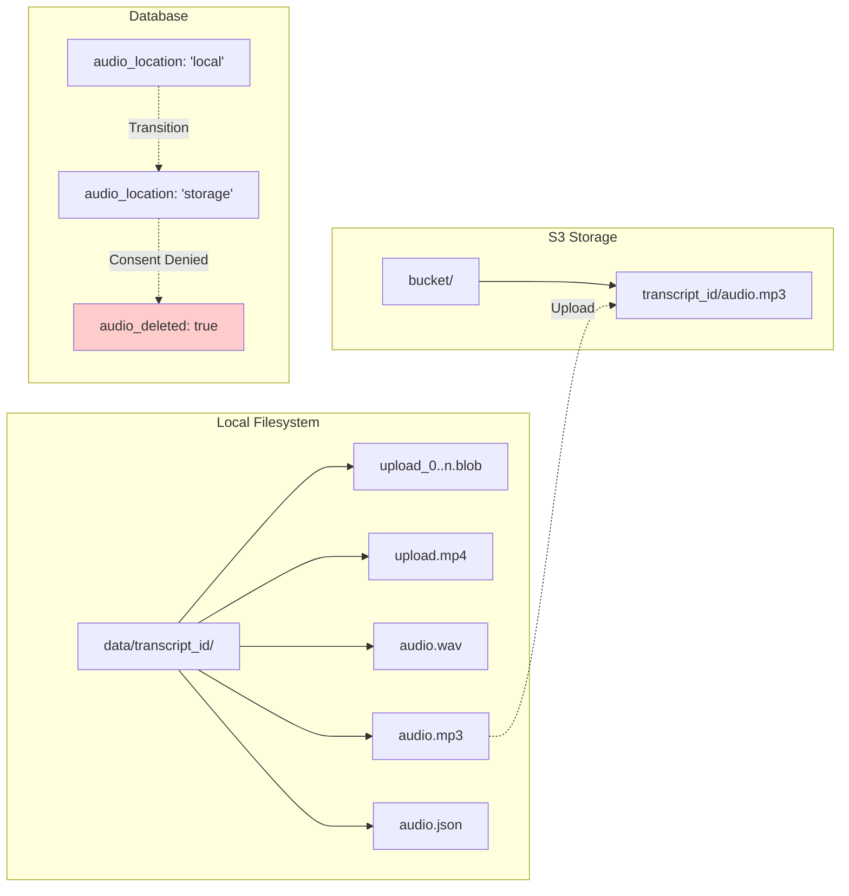
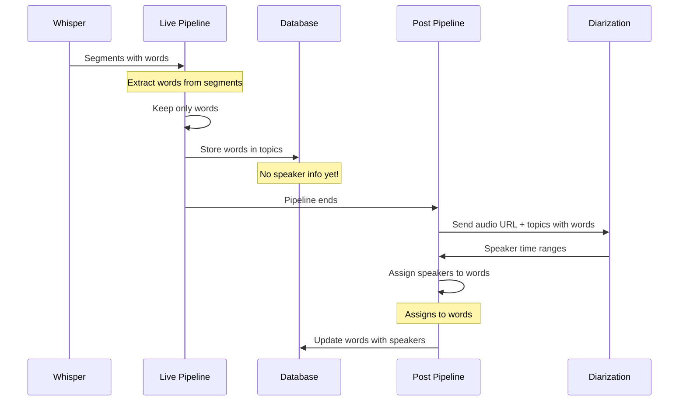

# Reflector Audio & Text Processing Flow

## Table of Contents
1. [Overview](#overview)
2. [Audio Input Sources](#audio-input-sources)
3. [Data Hierarchy & Transformations](#data-hierarchy--transformations)
4. [Processing Pipeline Architecture](#processing-pipeline-architecture)
5. [Storage & File Management](#storage--file-management)
6. [Current Architecture Details](#current-architecture-details)

## Overview

Reflector processes audio through multiple transformation stages, from raw audio input to semantic topics with speaker identification. This document describes the current implementation of the entire flow.

## Audio Input Sources



### 1. WebRTC Live Streaming
- **Entry**: `/transcripts/{transcript_id}/record/webrtc`
- **Real-time**: Processes audio frames as they arrive
- **Pipeline**: `PipelineMainLive` for immediate transcription

### 2. File Upload
- **Entry**: `/transcripts/{transcript_id}/record/upload`
- **Storage**: `data/{transcript_id}/upload.{ext}`
- **Validation**: Checks for valid audio stream
- **Processing**: Async via Celery task

### 3. Cloud Recordings (Whereby)
- **Automated**: Triggered by S3 bucket events
- **Integration**: Creates recording and transcript entries
- **Processing**: Same pipeline as uploads

## Data Hierarchy & Transformations

### Data Transformation Flow



#### Data Structure Details

```
WhisperSegments (ORIGINAL):
├── segment.text: "Hello, this is a complete sentence."
├── segment.start: 0.0
├── segment.end: 3.5
└── segment.words: [
      {"word": "Hello", "start": 0.0, "end": 0.5},
      {"word": "this", "start": 0.6, "end": 0.9}
    ]

SEGMENTS NOT PRESERVED IN CURRENT FLOW

Words Only (FLATTENED):
[
  {"text": "Hello", "start": 0.0, "end": 0.5, "speaker": ?},
  {"text": "this", "start": 0.6, "end": 0.9, "speaker": ?}
]

After Diarization:
[
  {"text": "Hello", "start": 0.0, "end": 0.5, "speaker": 0},
  {"text": "this", "start": 0.6, "end": 0.9, "speaker": 0}
]
```

### Current Data Storage Structure

```sql
transcript table:
├── topics (JSON)
│   └── [{
│       "id": "uuid",
│       "title": "LLM-generated title",
│       "summary": "LLM-generated summary",
│       "timestamp": 10.5,
│       "duration": 45.2,
│       "transcript": "Full text of this topic",
│       "words": [{"text": "word", "start": 10.5, "end": 10.8, "speaker": 0}]
│   }]
├── events (JSON)
│   ├── {"event": "STATUS", "data": {"value": "recording"}}
│   ├── {"event": "TRANSCRIPT", "data": {"text": "sentence from liner"}}
│   ├── {"event": "TOPIC", "data": {topic object}}
│   └── {"event": "WAVEFORM", "data": {waveform array}}
└── Other fields (title, short_summary, long_summary, participants)
```

## Processing Pipeline Architecture

### Live Pipeline (Real-time)



### Post-Processing Pipeline (After live ends)



## Storage & File Management

### File Lifecycle



### Storage Locations



## Current Architecture Details

### 1. Segment Information Processing
**Current Behavior**: Whisper segments are processed into individual words during transcription.

**Current State**: 
- Speakers are assigned to individual words
- Boundaries are created by different processors
- WebVTT generation will use available word data

**Data Flow**:
```python
# We have this valuable data:
segment = {
    "text": "Hello, how are you today?",
    "start": 0.0,
    "end": 3.5,
    "words": [...]
}

# But we only keep:
words = [
    {"text": "Hello,", "start": 0.0, "end": 0.5},
    {"text": "how", "start": 0.6, "end": 0.9},
    # ...
]
```

### 2. Boundary Creation Methods
**Current Implementation**: Text boundaries are created by different processors:

1. **TranscriptLiner**: Groups by punctuation (., ?, !)
2. **TopicDetector**: Groups by character count (1000+)

**Each processor serves different purposes**:
- Liner: Creates complete sentences for display
- Topics: Creates semantic chunks for LLM processing

### 3. Speaker Assignment Process
**Current Implementation**: Diarization occurs during post-processing.



**Diarization Input Data**:
```python
AudioDiarizationInput:
├── audio_url: str  # S3 URL to the audio file
└── topics: list[TitleSummaryWithId]
    └── each topic contains:
        ├── id: str
        ├── title: str
        ├── summary: str
        ├── timestamp: float
        ├── duration: float
        └── words: list[Word]  # Text with timings, no speakers yet
```

**Current Behavior**: 
- Speaker information is at word level
- Topics may contain multiple speakers

### 4. Topic-Based Storage
**Current Design**: Topics are semantic units (typically minutes long) while captions are temporal units (seconds).

**Data Organization**:
```
Topics:    [-----Topic 1 (2 min)-----][----Topic 2 (3 min)----]
           "Discussion about project"  "Planning next steps"

WebVTT:    [Cap1][Cap2][Cap3][Cap4][Cap5][Cap6][Cap7][Cap8]...
           3-5 second captions with speaker changes
```


## Summary

The current architecture processes audio through multiple stages:
- Whisper segments are converted to individual words
- Speaker information is added at the word level during post-processing
- Topics provide semantic organization for summarization
- Different processors create boundaries for different purposes