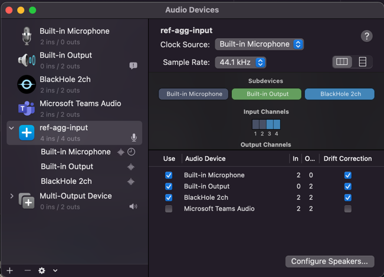
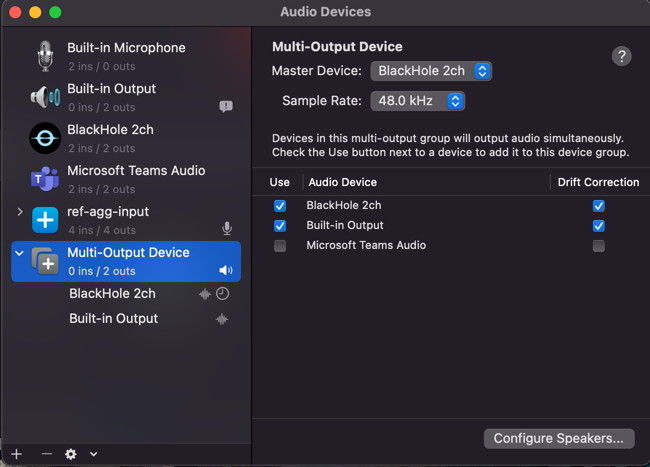

# Reflector

This is the code base for the Reflector demo (formerly called agenda-talk-diff) for the leads : Troy Web Consulting panel (A Chat with AWS about AI: Real AI/ML AWS projects and what you should know) on 6/14 at 430PM.

The target deliverable is a local-first live transcription and visualization tool to compare a discussion's target agenda/objectives to the actual discussion live.

To setup, 

1) Check values in config.ini file. Specifically add your OPENAI_APIKEY if you plan to use OpenAI API requests.
2) Run ``` export KMP_DUPLICATE_LIB_OK=True``` in Terminal. [This is taken care of in code, but not reflecting, Will fix this issue later.]
3) Run the script setup_depedencies.sh.

    ``` chmod +x setup_dependencies.sh ```

    ``` sh setup_dependencies.sh  <ENV>```

    
   ENV refers to the intended environment for JAX. JAX is available in several variants, [CPU | GPU | Colab TPU | Google Cloud TPU]
   
   ```ENV``` is :
   
   cpu -> JAX CPU installation

   cuda11 -> JAX CUDA 11.x version

   cuda12 -> JAX CUDA 12.x version (Core Weave has CUDA 12 version, can check with ```nvidia-smi```)

    ```sh setup_dependencies.sh cuda12```

4) ``` pip install -r requirements.txt```


5) Run the Whisper-JAX pipeline. Currently, the repo can take a Youtube video and transcribes/summarizes it.

``` python3 whisjax.py "https://www.youtube.com/watch?v=ihf0S97oxuQ" --transcript transcript.txt summary.txt ```

You can even run it on local file or a file in your configured S3 bucket.

``` python3 whisjax.py "startup.mp4" --transcript transcript.txt summary.txt ```

The script will take care of a few cases like youtube file, local file, video file, audio-only file, 
file in S3, etc. If local file is not present, it can automatically take the file from S3.


**S3 bucket:**

Everything you need for S3 is already configured in config.ini. Only edit it if you need to change it deliberately.

S3 bucket name is mentioned in config.ini. All transfers will happen between this bucket and the local computer where the
script is run.  You need AWS_ACCESS_KEY / AWS_SECRET_KEY to authenticate your calls to S3 (done in config.ini).

For AWS S3 Web UI,
1) Login to AWS management console.
2) Search for S3 in the search bar at the top.
3) Navigate to list the buckets under the current account, if needed and choose your bucket [```reflector-bucket```]
4) You should be able to see items in the bucket. You can upload/download files here directly.


For CLI, 
Refer to the FILE UTIL section below.


**FILE UTIL MODULE:**

A file_util module has been created to upload/download files with AWS S3 bucket pre-configured using config.ini. 
Though not needed for the workflow, if you need to upload / download file, separately on your own, apart from the pipeline workflow in the script, you can do so by :

Upload:

``` python3 file_util.py upload <object_name_in_S3_bucket>```

Download:

``` python3 file_util.py download <object_name_in_S3_bucket>```

If you want to access the S3 artefacts, from another machine, you can either use the python file_util with the commands
mentioned above or simply use the GUI of AWS Management Console.

**WORKFLOW:**

1) Specify the input source file from a local, youtube link or upload to S3 if needed and pass it as input to the script.If the source file is in
   ```.m4a``` format, it will get converted to ```.mp4``` automatically.
2) Keep the agenda header topics in a local file named ```agenda-headers.txt```. This needs to be present where the script is run.
   This version of the pipeline compares covered agenda topics using agenda headers in the following format.
   1) ```agenda_topic : <short description>```
3) Check all the values in ```config.ini```. You need to predefine 2 categories for which you need to scatter plot the 
   topic modelling visualization in the config file. This is the default visualization. But, from the dataframe artefact called
   ```df.pkl``` , you can load the df and choose different topics to plot. You can filter using certain words to search for the
   transcriptions and you can see the top influencers and characteristic in each topic we have chosen to plot in the
   interactive HTML document. I have added a new jupyter notebook that gives the base template to play around with, named
   ```Viz_experiments.ipynb```.
4) Run the script. The script automatically transcribes, summarizes and creates a scatter plot of words & topics in the form of an interactive
HTML file, a sample word cloud and uploads them to the S3 bucket
5) Additional artefacts pushed to S3:
   1) HTML visualization file
   2) pandas df in pickle format for others to collaborate and make their own visualizations
   3) Summary, transcript and transcript with timestamps file in text format.

    The script also creates 2 types of mappings.
   1) Timestamp -> The top 2 matched agenda topic
   2) Topic -> All matched timestamps in the transcription
   
Other visualizations can be planned based on available artefacts or new ones can be created. Refer the section ```Viz-experiments```.


**Visualization experiments:**

This is a jupyter notebook playground with template instructions on handling the metadata and data artefacts generated from the
pipeline. Follow the instructions given and tweak your own logic into it or use it as a playground to experiment libraries and
visualizations on top of the metadata.

**WHISPER-JAX REALTIME TRANSCRIPTION PIPELINE:**

We also support a provision to perform real-time transcripton using whisper-jax pipeline. But, there are 
a few pre-requisites before you run it on your local machine. The instructions are for 
configuring on a MacOS.

We need to way to route audio from an application opened via the browser, ex. "Whereby" and audio from your local
microphone input which you will be using for speaking. We use [Blackhole](https://github.com/ExistentialAudio/BlackHole).

1) Install Blackhole-2ch (2 ch is enough) by 1 of 2 options listed.
2) Setup [Aggregate device](https://github.com/ExistentialAudio/BlackHole/wiki/Aggregate-Device) to route web audio and
   local microphone input.

   Be sure to mirror the settings given (including the name)  
3) Setup [Multi-Output device](https://github.com/ExistentialAudio/BlackHole/wiki/Multi-Output-Device)
   
   Refer 

From the reflector root folder, 

run ```python3 whisjax_realtime_trial.py```

**Permissions:**

You may have to add permission for "Terminal"/Code Editors [Pycharm/VSCode, etc.] microphone access to record audio in 
```System Preferences -> Privacy & Security -> Microphone``` and in
```System Preferences -> Privacy & Security -> Accessibility```.


NEXT STEPS:

1) Create a RunPod setup for this feature (mentioned in 1 & 2) and test it end-to-end
2) Perform Speaker Diarization using Whisper-JAX
3) Based on the feasibility of the above points, explore suitable visualizations for transcription & summarization.
