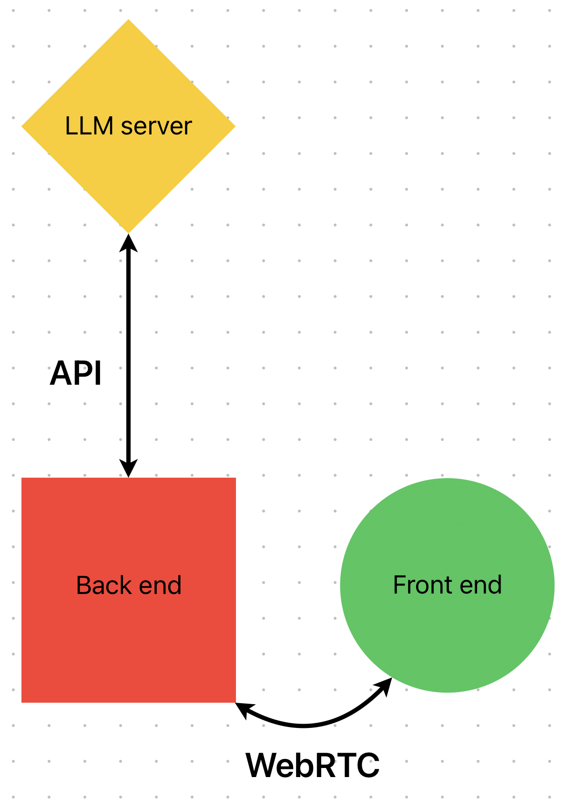

# Reflector

Reflector is a cutting-edge web application under development by Monadical. It utilizes AI to record meetings, providing a permanent record with transcripts, translations, and automated summaries.

The project architecture consists of three primary components:

* **Front-End**: NextJS React project hosted on Vercel, located in `www/`.
* **Back-End**: Python server that offers an API and data persistence, found in `server/`.
* **AI Models**: Providing services such as speech-to-text transcription, topic generation, automated summaries, and translations.



## Table of Contents

- [Reflector](#reflector)
  - [Table of Contents](#table-of-contents)
  - [Miscellaneous](#miscellaneous)
    - [Contribution Guidelines](#contribution-guidelines)
    - [How to Install Blackhole (Mac Only)](#how-to-install-blackhole-mac-only)
  - [Front-End](#front-end)
    - [Installation](#installation)
    - [Run the Application](#run-the-application)
    - [OpenAPI Code Generation](#openapi-code-generation)
  - [Back-End](#back-end)
    - [Installation](#installation-1)
    - [Start the project](#start-the-project)
      - [Using docker](#using-docker)
    - [Using local GPT4All](#using-local-gpt4all)
    - [Using local files](#using-local-files)
  - [AI Models](#ai-models)

## Miscellaneous

### Contribution Guidelines

All new contributions should be made in a separate branch. Before any code is merged into `master`, it requires a code review.

### How to Install Blackhole (Mac Only)

Note: We currently do not have instructions for Windows users.

* Install [Blackhole](https://github.com/ExistentialAudio/BlackHole)-2ch (2 ch is enough) by 1 of 2 options listed.
* Setup ["Aggregate device"](https://github.com/ExistentialAudio/BlackHole/wiki/Aggregate-Device) to route web audio and local microphone input.
* Setup [Multi-Output device](https://github.com/ExistentialAudio/BlackHole/wiki/Multi-Output-Device)
* Then goto ```System Preferences -> Sound``` and choose the devices created from the Output and Input tabs.
* The input from your local microphone, the browser run meeting should be aggregated into one virtual stream to listen to and the output should be fed back to your specified output devices if everything is configured properly.

Permissions:

You may have to add permission for browser's microphone access to record audio in
```System Preferences -> Privacy & Security -> Microphone```
```System Preferences -> Privacy & Security -> Accessibility```. You will be prompted to provide these when you try to connect.

## Front-End

### Installation

To install the application, run:

```bash
yarn install
```

### Run the Application

To run the application in development mode, run:

```bash
yarn dev
```

Then open [http://localhost:3000](http://localhost:3000) to view it in the browser.

### OpenAPI Code Generation

To generate the TypeScript files from the openapi.json file, make sure the python server is running, then run:

```bash
yarn openapi
```

You may need to run `yarn global add @openapitools/openapi-generator-cli` first. You also need a Java runtime installed on your machine.

## Back-End

### Installation

Run:

```bash
poetry install
```

Then create an `.env` with:

```
TRANSCRIPT_BACKEND=modal
TRANSCRIPT_URL=https://monadical-sas--reflector-transcriber-web.modal.run
TRANSCRIPT_MODAL_API_KEY=<omitted>

LLM_BACKEND=modal
LLM_URL=https://monadical-sas--reflector-llm-web.modal.run
LLM_MODAL_API_KEY=<omitted>

AUTH_BACKEND=fief
AUTH_FIEF_URL=https://auth.reflector.media/reflector-local
AUTH_FIEF_CLIENT_ID=KQzRsNgoY<omitted>
AUTH_FIEF_CLIENT_SECRET=<omitted>

LLM_URL=http://IP:HOST/api/v1/generate
```

### Start the project

Use:

```bash
poetry run python3 -m reflector.app
```

#### Using docker

Use:

```bash
docker-compose up server
```

### Using local GPT4All

- Start GPT4All with any model you want
- Ensure the API server is activated in GPT4all
- Run with: `LLM_BACKEND=openai LLM_URL=http://localhost:4891/v1/completions LLM_OPENAI_MODEL="GPT4All Falcon" python -m reflector.app`


### Using local files

```
poetry run python -m reflector.tools.process path/to/audio.wav
```

## AI Models

*(Documentation for this section is pending.)*