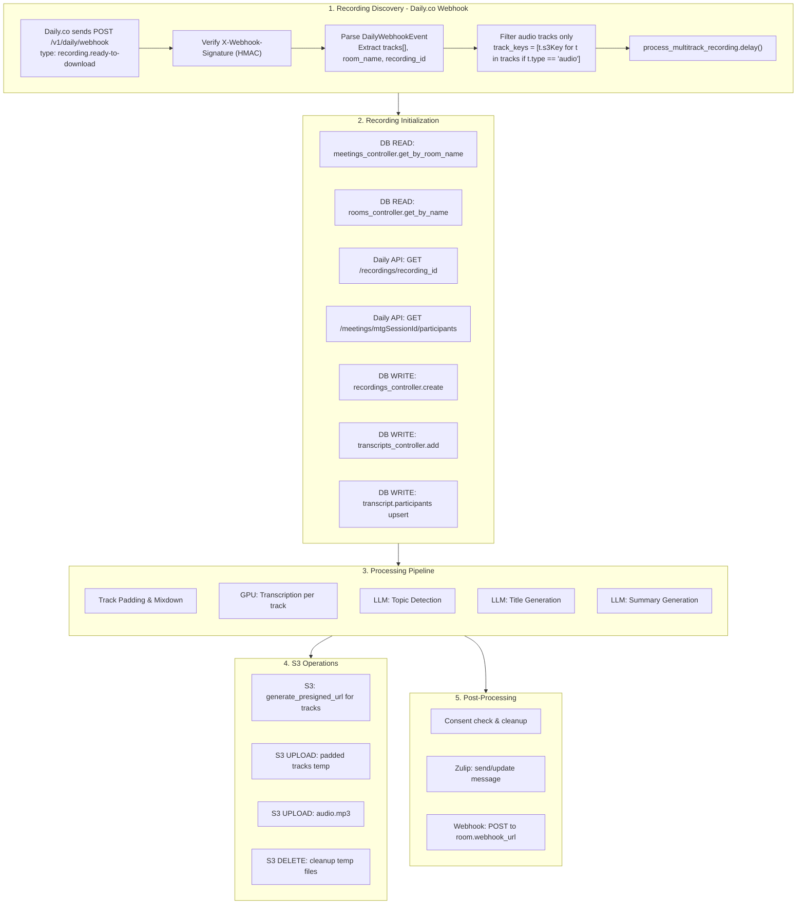
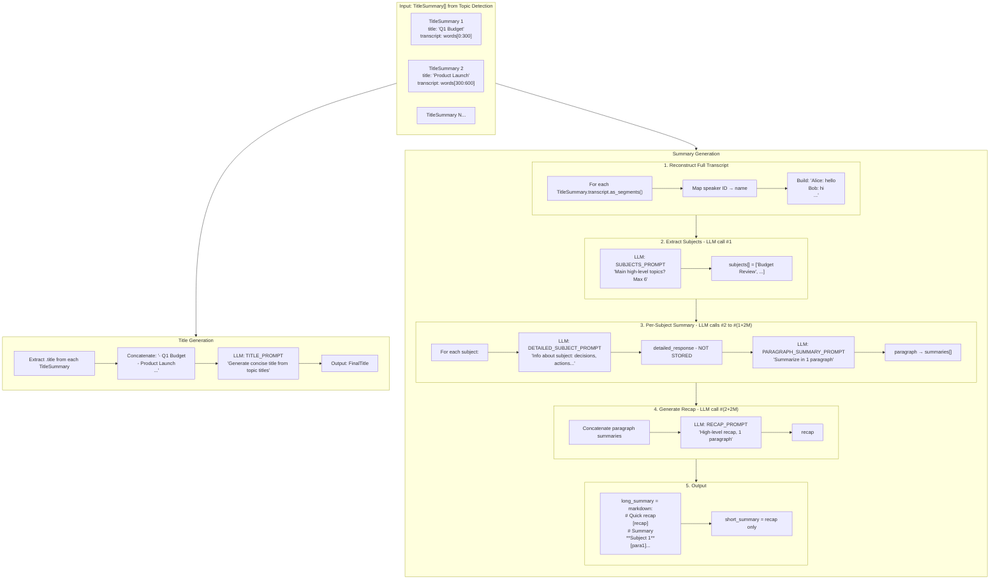

# Daily.co pipeline

This document details every external call, storage operation, and database write that occurs when a new Daily.co recording is discovered.
It includes a bunch of common logic that other pipelines use, therefore not everything is Daily-oriented.

**The doc was generated at 12.12.2025 and things may have changed since.**

## Trigger

Two entry points, both converging to the same handler:

1. **Webhook**: Daily.co sends `POST /v1/daily/webhook` with `recording.ready-to-download`
2. **Polling**: `GET /recordings` (paginated, max 100/call) → filter new → convert to same payload format

Both produce `RecordingReadyPayload` and call `handleRecordingReady(payload)`.

```
┌─────────────────┐     ┌──────────────────────────┐
│  Daily Webhook  │────▶│  RecordingReadyPayload   │
│  (push)         │     │  {room_name, recording_id│
└─────────────────┘     │   tracks[], ...}         │
                        └────────────┬─────────────┘
┌─────────────────┐                  │
│  GET /recordings│                  ▼
│  (poll)         │────▶ convert ──▶ handleRecordingReady()
└─────────────────┘                  │
                                     ▼
                        ┌────────────────────────┐
                        │ process_multitrack_    │
                        │ recording pipeline     │
                        └────────────────────────┘
```

**Polling API**: `GET https://api.daily.co/v1/recordings`
- Pagination: `limit` (max 100), `starting_after`, `ending_before`
- Rate limit: ~2 req/sec
- Response: `{total_count, data: Recording[]}`



## Detailed Sequence: Daily.co Multitrack Recording

```mermaid
sequenceDiagram
    participant DailyCo as Daily.co
    participant API as FastAPI /v1/daily/webhook
    participant Worker as Celery Worker
    participant DB as PostgreSQL
    participant DailyAPI as Daily.co REST API
    participant S3 as AWS S3
    participant GPU as Modal.com GPU
    participant LLM as LLM Service
    participant WS as WebSocket
    participant Zulip as Zulip
    participant ExtWH as External Webhook

    Note over DailyCo,API: Phase 0: Webhook Receipt
    DailyCo->>API: POST /v1/daily/webhook
    Note right of DailyCo: X-Webhook-Signature, X-Webhook-Timestamp
    API->>API: verify_webhook_signature()
    API->>API: Extract audio track s3Keys from payload.tracks[]
    API->>Worker: process_multitrack_recording.delay()
    API-->>DailyCo: 200 OK

    Note over Worker,DailyAPI: Phase 1: Recording Initialization
    Worker->>DB: SELECT meeting WHERE room_name=?
    Worker->>DB: SELECT room WHERE name=?
    Worker->>DailyAPI: GET /recordings/{recording_id}
    DailyAPI-->>Worker: {mtgSessionId, ...}
    Worker->>DailyAPI: GET /meetings/{mtgSessionId}/participants
    DailyAPI-->>Worker: [{participant_id, user_name}, ...]
    Worker->>DB: INSERT INTO recording
    Worker->>DB: INSERT INTO transcript (status='idle')
    loop For each track_key (parse participant_id from filename)
        Worker->>DB: UPSERT transcript.participants[speaker=idx, name=X]
    end

    Note over Worker,S3: Phase 2: Track Padding
    Worker->>DB: UPDATE transcript SET status='processing'
    Worker->>WS: broadcast STATUS='processing'
    loop For each track in track_keys (N tracks)
        Worker->>S3: generate_presigned_url(track_key, DAILYCO_BUCKET)
        S3-->>Worker: presigned_url (2hr)
        Note over Worker: PyAV: read WebM, extract start_time
        Note over Worker: PyAV: adelay filter (pad silence)
        Worker->>S3: PUT file_pipeline/{id}/tracks/padded_{idx}.webm
        Worker->>S3: generate_presigned_url(padded_{idx}.webm)
    end

    Note over Worker,S3: Phase 3: Audio Mixdown
    Note over Worker: PyAV: amix filter → stereo MP3
    Worker->>DB: UPDATE transcript SET duration=X
    Worker->>WS: broadcast DURATION
    Worker->>S3: PUT {transcript_id}/audio.mp3
    Worker->>DB: UPDATE transcript SET audio_location='storage'

    Note over Worker: Phase 4: Waveform
    Note over Worker: Generate peaks from MP3
    Worker->>DB: UPDATE events+=WAVEFORM
    Worker->>WS: broadcast WAVEFORM

    Note over Worker,GPU: Phase 5: Transcription (N GPU calls)
    loop For each padded track URL (N tracks)
        Worker->>GPU: POST /v1/audio/transcriptions-from-url
        Note right of GPU: {audio_file_url, language, batch:true}
        GPU-->>Worker: {words: [{word, start, end}, ...]}
        Note over Worker: Assign speaker=track_idx to words
    end
    Note over Worker: Merge all words, sort by start time
    Worker->>DB: UPDATE events+=TRANSCRIPT
    Worker->>WS: broadcast TRANSCRIPT

    Note over Worker,S3: Cleanup temp files
    loop For each padded file
        Worker->>S3: DELETE padded_{idx}.webm
    end

    Note over Worker,LLM: Phase 6: Topic Detection (C LLM calls)
    Note over Worker: C = ceil(total_words / 300)
    loop For each 300-word chunk (C chunks)
        Worker->>LLM: TOPIC_PROMPT + words[i:i+300]
        Note right of LLM: "Extract main topic title + 2-sentence summary"
        LLM-->>Worker: TitleSummary{title, summary}
        Worker->>DB: UPSERT topics[]
        Worker->>DB: UPDATE events+=TOPIC
        Worker->>WS: broadcast TOPIC
    end

    Note over Worker,LLM: Phase 7a: Title Generation (1 LLM call)
    Note over Worker: Input: all TitleSummary[].title joined
    Worker->>LLM: TITLE_PROMPT
    Note right of LLM: "Generate concise title from topic titles"
    LLM-->>Worker: "Meeting Title"
    Worker->>DB: UPDATE transcript SET title=X
    Worker->>DB: UPDATE events+=FINAL_TITLE
    Worker->>WS: broadcast FINAL_TITLE

    Note over Worker,LLM: Phase 7b: Summary Generation (2+2M LLM calls)
    Note over Worker: Reconstruct full transcript from TitleSummary[].transcript
    opt If participants unknown
        Worker->>LLM: PARTICIPANTS_PROMPT
        LLM-->>Worker: ParticipantsResponse
    end
    Worker->>LLM: SUBJECTS_PROMPT (call #1)
    Note right of LLM: "Main high-level topics? Max 6"
    LLM-->>Worker: SubjectsResponse{subjects: ["A", "B", ...]}

    loop For each subject (M subjects, max 6)
        Worker->>LLM: DETAILED_SUBJECT_PROMPT (call #2..#1+M)
        Note right of LLM: "Info about 'A': decisions, actions, deadlines"
        LLM-->>Worker: detailed_response (discarded after next call)
        Worker->>LLM: PARAGRAPH_SUMMARY_PROMPT (call #2+M..#1+2M)
        Note right of LLM: "Summarize in 1 paragraph"
        LLM-->>Worker: paragraph → summaries[]
    end

    Worker->>LLM: RECAP_PROMPT (call #2+2M)
    Note right of LLM: "High-level quick recap, 1 paragraph"
    LLM-->>Worker: recap
    Note over Worker: long_summary = "# Quick recap\n{recap}\n# Summary\n**A**\n{para1}..."
    Note over Worker: short_summary = recap only
    Worker->>DB: UPDATE long_summary, short_summary
    Worker->>DB: UPDATE events+=FINAL_LONG_SUMMARY
    Worker->>WS: broadcast FINAL_LONG_SUMMARY
    Worker->>DB: UPDATE events+=FINAL_SHORT_SUMMARY
    Worker->>WS: broadcast FINAL_SHORT_SUMMARY

    Note over Worker,DB: Phase 8: Finalize
    Worker->>DB: UPDATE transcript SET status='ended'
    Worker->>DB: UPDATE events+=STATUS
    Worker->>WS: broadcast STATUS='ended'

    Note over Worker,ExtWH: Phase 9: Post-Processing Chain
    Worker->>DB: SELECT meeting_consent WHERE meeting_id=?
    alt Any consent denied
        Worker->>S3: DELETE tracks from DAILYCO_BUCKET
        Worker->>S3: DELETE audio.mp3 from TRANSCRIPT_BUCKET
        Worker->>DB: UPDATE transcript SET audio_deleted=true
    end

    opt Room has zulip_auto_post=true
        alt Existing zulip_message_id
            Worker->>Zulip: PATCH /api/v1/messages/{id}
        else New
            Worker->>Zulip: POST /api/v1/messages
            Zulip-->>Worker: {id}
            Worker->>DB: UPDATE transcript SET zulip_message_id=X
        end
    end

    opt Room has webhook_url
        Worker->>ExtWH: POST {webhook_url}
        Note right of ExtWH: X-Webhook-Signature: HMAC-SHA256
        Note right of ExtWH: Body: {transcript_id, room_id, ...}
    end
```



## Title & Summary Generation Data Flow



### topics[] vs subjects[]

| | topics[] | subjects[] |
|-|----------|------------|
| **Source** | 300-word chunk splitting | LLM extraction from full text |
| **Count** | Variable (words / 300) | Max 6 |
| **Purpose** | Timeline segmentation | Summary structure |
| **Has timestamp?** | Yes | No |

## External API Calls Summary

### 1. Daily.co REST API (called during initialization)

| Endpoint | Method | When | Purpose |
|----------|--------|------|---------|
| `GET /recordings/{recording_id}` | GET | After webhook | Get mtgSessionId for participant lookup |
| `GET /meetings/{mtgSessionId}/participants` | GET | After above | Map participant_id → user_name |

### 2. GPU Service (Modal.com or Self-Hosted)

| Endpoint | Method | Count | Request |
|----------|--------|-------|---------|
| `{TRANSCRIPT_URL}/v1/audio/transcriptions-from-url` | POST | **N** (N = num tracks) | `{audio_file_url, language, batch: true}` |

**Note**: Diarization is NOT called for multitrack - speaker identification comes from separate tracks.

### 3. LLM Service (OpenAI-compatible via LlamaIndex)

| Phase | Operation | Input | LLM Calls | Output |
|-------|-----------|-------|-----------|--------|
| Topic Detection | TOPIC_PROMPT per 300-word chunk | words[i:i+300] | **C** = ceil(words/300) | TitleSummary{title, summary, timestamp} |
| Title Generation | TITLE_PROMPT | All topic titles joined | **1** | FinalTitle |
| Participant ID | PARTICIPANTS_PROMPT | Full transcript | **0-1** (skipped if known) | ParticipantsResponse |
| Subject Extraction | SUBJECTS_PROMPT | Full transcript | **1** | SubjectsResponse{subjects[]} |
| Subject Detail | DETAILED_SUBJECT_PROMPT | Full transcript + subject name | **M** (M = subjects, max 6) | detailed text (discarded) |
| Subject Paragraph | PARAGRAPH_SUMMARY_PROMPT | Detailed text | **M** | paragraph text → summaries[] |
| Recap | RECAP_PROMPT | All paragraph summaries | **1** | recap text |

**Total LLM calls**: C + 2M + 3 (+ 1 if participants unknown)
- Short meeting (1000 words, 3 subjects): ~4 + 6 + 3 = **13 calls**
- Long meeting (5000 words, 6 subjects): ~17 + 12 + 3 = **32 calls**

## S3 Operations Summary

### Source Bucket: `DAILYCO_STORAGE_AWS_BUCKET_NAME`
Daily.co uploads raw-tracks recordings here.

| Operation | Key Pattern | When |
|-----------|-------------|------|
| **READ** (presign) | `{domain}/{room_name}/{ts}/{participant_id}-cam-audio-{ts}.webm` | Track acquisition |
| **DELETE** | Same as above | Consent denied cleanup |

### Transcript Storage Bucket: `TRANSCRIPT_STORAGE_AWS_BUCKET_NAME`
Reflector's own storage.

| Operation | Key Pattern | When |
|-----------|-------------|------|
| **PUT** | `file_pipeline/{transcript_id}/tracks/padded_{idx}.webm` | After track padding |
| **READ** (presign) | Same | For GPU transcription |
| **DELETE** | Same | After transcription complete |
| **PUT** | `{transcript_id}/audio.mp3` | After mixdown |
| **DELETE** | Same | Consent denied cleanup |

## Database Operations

### Tables Written

| Table | Operation | When |
|-------|-----------|------|
| `recording` | INSERT | Initialization |
| `transcript` | INSERT | Initialization |
| `transcript` | UPDATE (participants) | After Daily API participant fetch |
| `transcript` | UPDATE (status, events, duration, topics, title, summaries, etc.) | Throughout pipeline |

### Transcript Update Sequence

```
1.  INSERT: id, name, status='idle', source_kind='room', user_id, recording_id, room_id, meeting_id
2.  UPDATE: participants[] (speaker index → participant name mapping)
3.  UPDATE: status='processing', events+=[{event:'STATUS', data:{value:'processing'}}]
4.  UPDATE: duration=X, events+=[{event:'DURATION', data:{duration:X}}]
5.  UPDATE: audio_location='storage'
6.  UPDATE: events+=[{event:'WAVEFORM', data:{waveform:[...]}}]
7.  UPDATE: events+=[{event:'TRANSCRIPT', data:{text, translation}}]
8.  UPDATE: topics[]+=topic, events+=[{event:'TOPIC'}]  -- repeated per chunk
9.  UPDATE: title=X, events+=[{event:'FINAL_TITLE'}]
10. UPDATE: long_summary=X, events+=[{event:'FINAL_LONG_SUMMARY'}]
11. UPDATE: short_summary=X, events+=[{event:'FINAL_SHORT_SUMMARY'}]
12. UPDATE: status='ended', events+=[{event:'STATUS', data:{value:'ended'}}]
13. UPDATE: zulip_message_id=X  -- if Zulip enabled
14. UPDATE: audio_deleted=true  -- if consent denied
```

## WebSocket Events

All broadcast to room `ts:{transcript_id}`:

| Event | Payload | Trigger |
|-------|---------|---------|
| STATUS | `{value: "processing"\|"ended"\|"error"}` | Status transitions |
| DURATION | `{duration: float}` | After audio processing |
| WAVEFORM | `{waveform: float[]}` | After waveform generation |
| TRANSCRIPT | `{text: string, translation: string\|null}` | After transcription merge |
| TOPIC | `{id, title, summary, timestamp, duration, transcript, words}` | Per topic detected |
| FINAL_TITLE | `{title: string}` | After LLM title generation |
| FINAL_LONG_SUMMARY | `{long_summary: string}` | After LLM summary |
| FINAL_SHORT_SUMMARY | `{short_summary: string}` | After LLM recap |

User-room broadcasts to `user:{user_id}`:
- `TRANSCRIPT_STATUS`
- `TRANSCRIPT_FINAL_TITLE`
- `TRANSCRIPT_DURATION`
