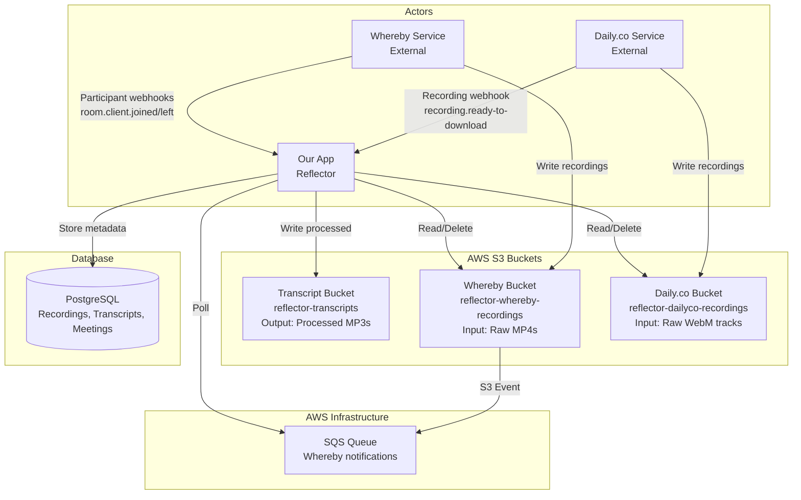
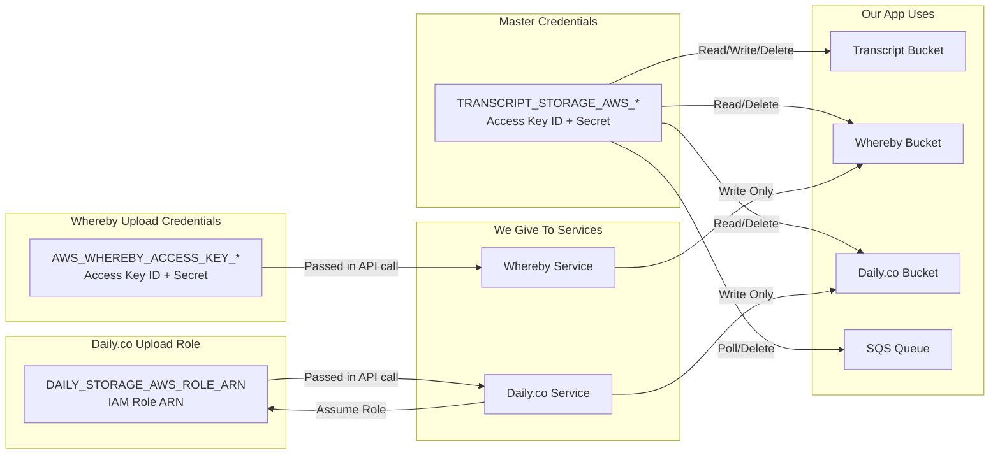

# Reflector Architecture: Whereby + Daily.co Recording Storage

## System Overview



**Note on Webhook vs S3 Event for Recording Processing:**
- **Whereby**: Uses S3 Events → SQS for recording availability (S3 as source of truth, no race conditions)
- **Daily.co**: Uses webhooks for recording availability (more immediate, built-in reliability)
- **Both**: Use webhooks for participant tracking (real-time updates)

## Credentials & Permissions



# Video Platform Recording Integration

This document explains how Reflector receives and identifies multitrack audio recordings from different video platforms.

## Platform Comparison

| Platform | Delivery Method | Track Identification |
|----------|----------------|---------------------|
| **Daily.co** | Webhook | Explicit track list in payload |
| **Whereby** | SQS (S3 notifications) | Single file per notification |

---

## Daily.co

**Note:** Primary discovery via polling (`poll_daily_recordings`), webhooks as backup.

Daily.co uses **webhooks** to notify Reflector when recordings are ready.

### How It Works

1. **Daily.co sends webhook** when recording is ready
   - Event type: `recording.ready-to-download`
   - Endpoint: `/v1/daily/webhook` (`reflector/views/daily.py:46-102`)

2. **Webhook payload explicitly includes track list**:
```json
{
  "recording_id": "7443ee0a-dab1-40eb-b316-33d6c0d5ff88",
  "room_name": "daily-20251020193458",
  "tracks": [
    {
      "type": "audio",
      "s3Key": "monadical/daily-20251020193458/1760988935484-52f7f48b-fbab-431f-9a50-87b9abfc8255-cam-audio-1760988935922",
      "size": 831843
    },
    {
      "type": "audio",
      "s3Key": "monadical/daily-20251020193458/1760988935484-a37c35e3-6f8e-4274-a482-e9d0f102a732-cam-audio-1760988943823",
      "size": 408438
    },
    {
      "type": "video",
      "s3Key": "monadical/daily-20251020193458/...-video.webm",
      "size": 30000000
    }
  ]
}
```

3. **System extracts audio tracks** (`daily.py:211`):
```python
track_keys = [t.s3Key for t in tracks if t.type == "audio"]
```

4. **Triggers multitrack processing** (`daily.py:213-218`):
```python
process_multitrack_recording.delay(
    bucket_name=bucket_name,  # reflector-dailyco-local
    room_name=room_name,      # daily-20251020193458
    recording_id=recording_id, # 7443ee0a-dab1-40eb-b316-33d6c0d5ff88
    track_keys=track_keys      # Only audio s3Keys
)
```

### Key Advantage: No Ambiguity

Even though multiple meetings may share the same S3 bucket/folder (`monadical/`), **there's no ambiguity** because:
- Each webhook payload contains the exact `s3Key` list for that specific `recording_id`
- No need to scan folders or guess which files belong together
- Each track's s3Key includes the room timestamp subfolder (e.g., `daily-20251020193458/`)

The room name includes timestamp (`daily-20251020193458`) to keep recordings organized, but **the webhook's explicit track list is what prevents mixing files from different meetings**.

### Track Timeline Extraction

Daily.co provides timing information in two places:

**1. PyAV WebM Metadata (current approach)**:
```python
# Read from WebM container stream metadata
stream.start_time = 8.130s  # Meeting-relative timing
```

**2. Filename Timestamps (alternative approach, commit 3bae9076)**:
```
Filename format: {recording_start_ts}-{uuid}-cam-audio-{track_start_ts}.webm
Example: 1760988935484-52f7f48b-fbab-431f-9a50-87b9abfc8255-cam-audio-1760988935922.webm

Parse timestamps:
- recording_start_ts: 1760988935484 (Unix ms)
- track_start_ts: 1760988935922 (Unix ms)
- offset: (1760988935922 - 1760988935484) / 1000 = 0.438s
```

**Time Difference (PyAV vs Filename)**:
```
Track 0:
  Filename offset: 438ms
  PyAV metadata:   229ms
  Difference:      ~200ms

Track 1:
  Filename offset: 8339ms
  PyAV metadata:   8130ms
  Difference:      ~200ms
```

**Consistent ~200ms delta** suggests network/encoding delay between file upload initiation (filename) and actual audio stream start (metadata).

**Note:** The ~200ms difference observed in this test recording is not crucial for timing accuracy. Either method (filename timestamps or PyAV metadata) works well for multi-track alignment. Filename timestamps are preferable as they are better officially documented by Daily.co.

**Current implementation uses PyAV metadata** because:
- More accurate (represents when audio actually started)
- Padding BEFORE transcription produces correct Whisper timestamps automatically
- No manual offset adjustment needed during transcript merge

### Why Re-encoding During Padding

Padding coincidentally involves re-encoding, which is important for Daily.co + Whisper:

**Problem:** Daily.co skips frames in recordings when microphone is muted or paused
- WebM containers have gaps where audio frames should be
- Whisper doesn't understand these gaps and produces incorrect timestamps
- Example: 5s of audio with 2s muted → file has frames only for 3s, Whisper thinks duration is 3s

**Solution:** Re-encoding via PyAV filter graph (`adelay` + `aresample`)
- Restores missing frames as silence
- Produces continuous audio stream without gaps
- Whisper now sees correct duration and produces accurate timestamps

**Why combined with padding:**
- Already re-encoding for padding (adding initial silence)
- More performant to do both operations in single PyAV pipeline
- Padded values needed for mixdown anyway (creating final MP3)

Implementation: `main_multitrack_pipeline.py:_apply_audio_padding_streaming()`

---

## Whereby (SQS-based)

Whereby uses **AWS SQS** (via S3 notifications) to notify Reflector when files are uploaded.

### How It Works

1. **Whereby uploads recording** to S3
2. **S3 sends notification** to SQS queue (one notification per file)
3. **Reflector polls SQS queue** (`worker/process.py:process_messages()`)
4. **System processes single file** (`worker/process.py:process_recording()`)

### Key Difference from Daily.co

**Whereby (SQS):** System receives S3 notification "file X was created" - only knows about one file at a time, would need to scan folder to find related files

**Daily.co (Webhook):** Daily explicitly tells system which files belong together in the webhook payload

---


