# Daily.co Event-Driven Polling Architecture

## Overview

This document details the **event-driven polling architecture** for Daily.co participant presence tracking.

**Core Principle:** Participant webhooks don't write to DB, they only signal "this meeting needs polling".

**Note on Scope:** This architecture currently applies to **participant events only** (join/left). Recording webhooks queue tasks directly.

**Architecture:**
- **Single Writer:** Only polling updates DB (eliminates race conditions)
- **Event Triggers:** Webhooks + reconciliation timer set "needs poll" flags
- **Event Coalescing:** Multiple webhooks → single poll covers all changes
- **Fast Response:** Participant webhooks just set Redis flag and return immediately
- **Resilience:** Lost webhooks caught by 30s reconciliation timer

**All scenarios are illustrated with Mermaid sequence diagrams showing:**
- Event flow (webhook → flag → poll → DB)
- Event coalescing (multiple triggers → single poll)
- Reconciliation fallback mechanism
- Lock patterns for concurrent workers

## Implicit State Machine

The architecture creates an **implicit state machine** with three states:

```
States:
1. IDLE         - No flag exists (default state)
2. NEEDS_POLL   - Flag exists (webhook/reconciliation set it)
3. POLLING      - Flag claimed, poll in progress (transient, not observable in Redis)

Transitions:
IDLE → NEEDS_POLL:       Webhook or timer sets flag
NEEDS_POLL → POLLING:    Worker atomically claims flag (GETDEL)
POLLING → IDLE:          Poll completes (no explicit action needed)
```

**Design Trade-off:** Reconciliation runs unconditionally every 30s, setting flags for ALL active Daily.co meetings regardless of recent polls. This causes redundant API calls but:
- Keeps implementation simple (no timestamp tracking)
- Guarantees eventual consistency within 30s
- Redundant polls are safe (idempotent operations)
- Acceptable overhead for active meetings

## Redis Keys Architecture

### 1. Poll Request Flag
- **Key Pattern:** `meeting_poll_requested:{meeting_id}`
- **Value:** `"1"` (presence indicates poll needed)
- **TTL:** None (flag cleared by atomic GETDEL, reconciliation re-sets every 30s)
- **Purpose:** Signal that meeting needs polling
- **Set by:** Participant webhooks OR reconciliation timer (idempotent)
- **Cleared by:** Poll worker (atomic GETDEL)

### 2. Poll Execution Lock
- **Key Pattern:** `meeting_presence_poll:{meeting_id}`
- **Timeout:** 120s
- **Auto-extend:** Every 30s
- **Purpose:** Prevent concurrent polls by different workers
- **Pattern:** Distributed lock with automatic TTL extension

### 3. Recording Processing Lock
- **Key Pattern:** `recording:{recording_id}`
- **Timeout:** 600s (10 minutes)
- **Auto-extend:** Every 60s
- **Purpose:** Prevent duplicate transcription work for recording webhooks

### 4. Meeting Process Lock
- **Key Pattern:** `meeting_process_lock:{meeting_id}`
- **Timeout:** 120s
- **Auto-extend:** Every 30s
- **Purpose:** Prevent overlapping meeting processing runs

---

## Recording Processing Scenarios

**Note:** Scenarios 1-3 show recording processing (different architecture - webhooks queue tasks directly). Scenarios 4+ show the main event-driven polling architecture for participant presence.

### Scenario 1: Webhook vs Polling Race

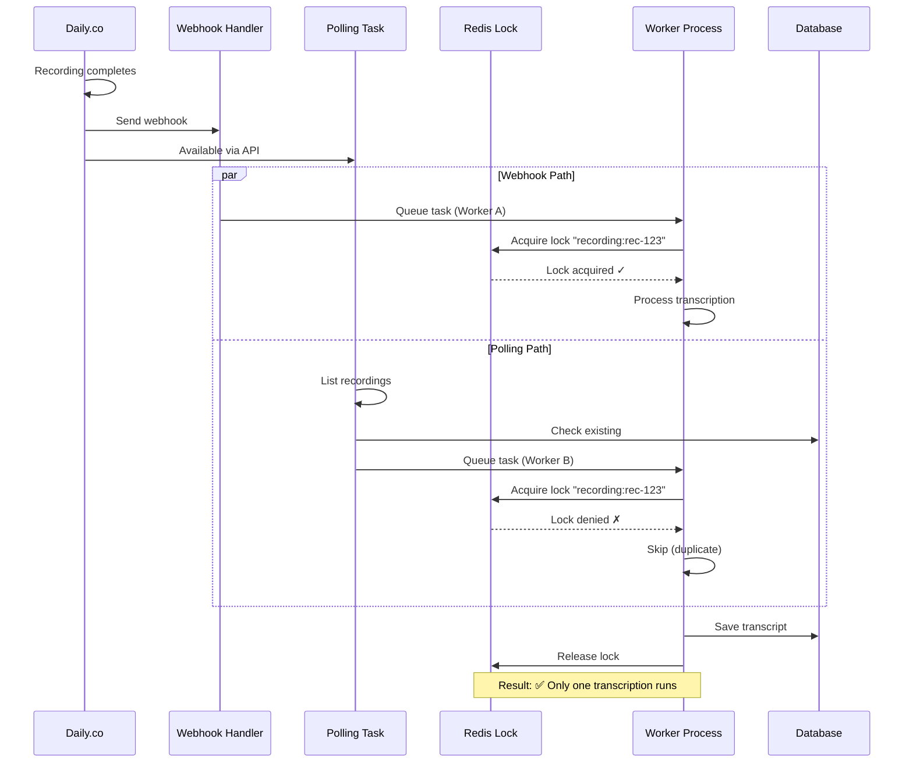

### Scenario 2: Lost Webhook, Poll Backup

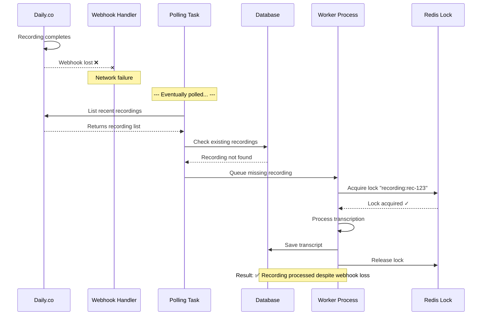

### Scenario 3: Duplicate Webhook Delivery

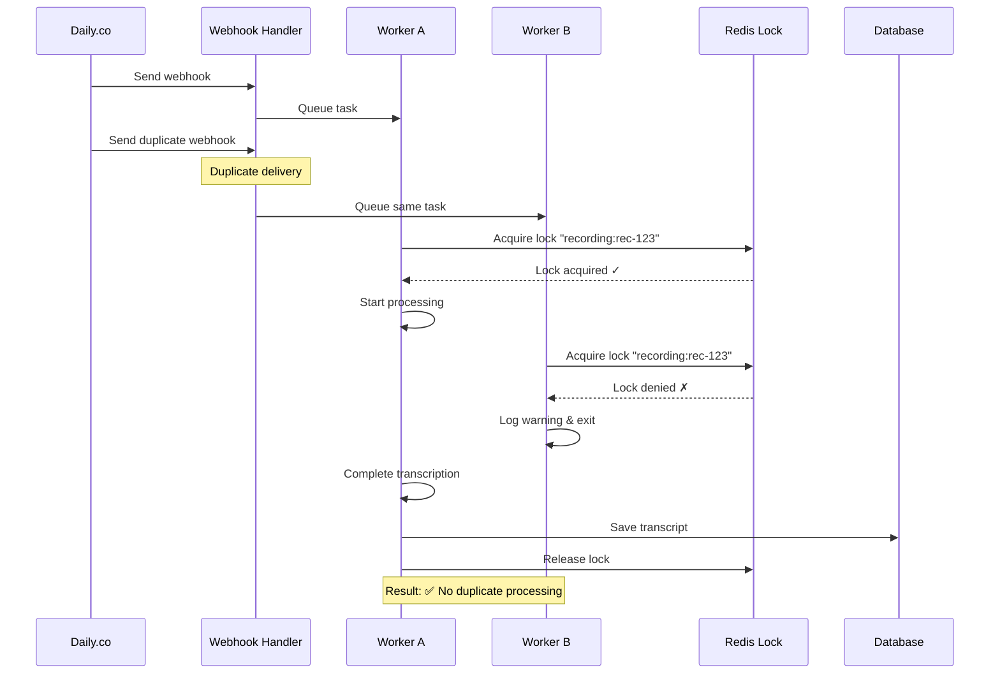

**Note:** This diagram shows concurrent duplicate webhooks where the lock provides protection. If a duplicate arrives after the first worker releases the lock, DB state checks prevent reprocessing (idempotent operation).

---

## Event-Driven Polling Scenarios

**Note:** Scenarios 4+ demonstrate the flag-based polling architecture described in this document (participant presence tracking).

### Scenario 4: Webhook Triggers Poll (Happy Path)

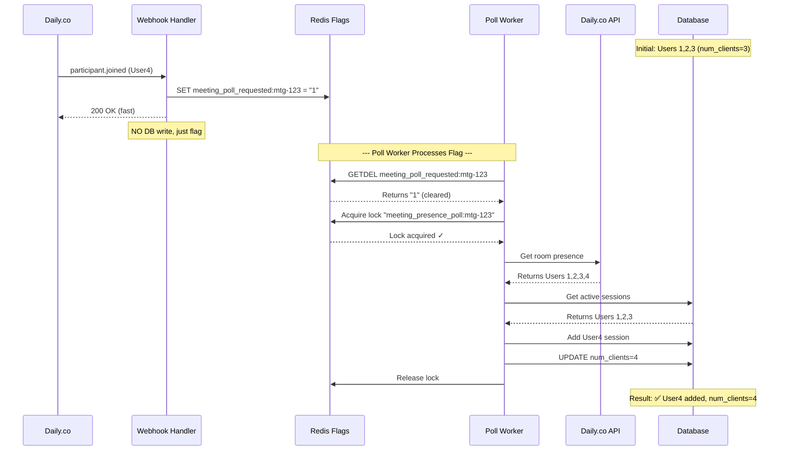

**Reconciliation Logic:** Poll worker compares API presence vs DB active sessions:
- `missing = API_ids - DB_ids` → Batch upsert new sessions (joins)
- `stale = DB_ids - API_ids` → Batch close sessions (leaves)
- Mixed cases (simultaneous joins+leaves) handled in single poll

### Scenario 5: Event Coalescing (Multiple Webhooks)

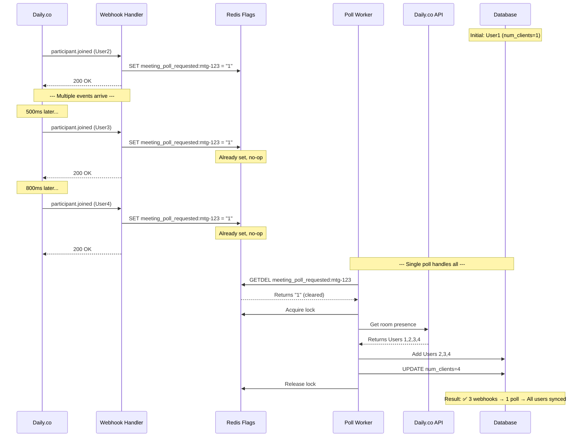

### Scenario 6: Lost Webhook Recovery (Reconciliation Timer)

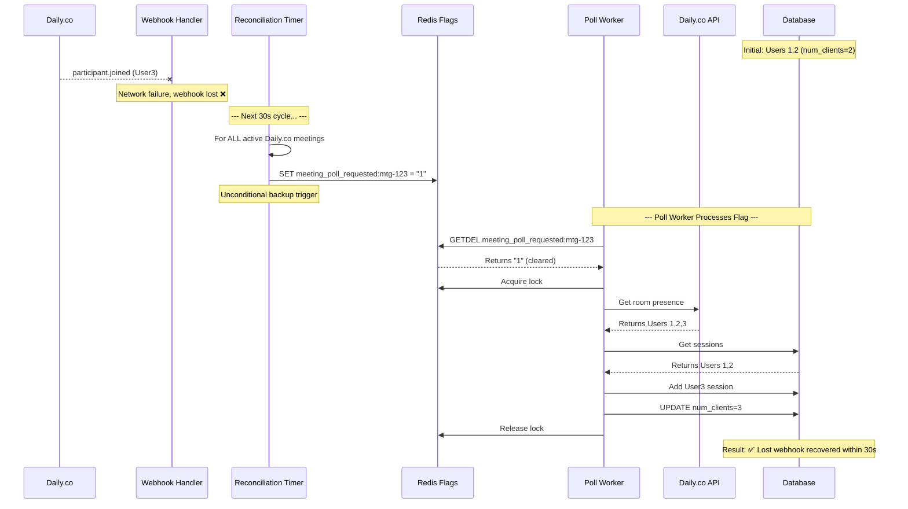

### Scenario 7: Reconciliation Causes Redundant Poll

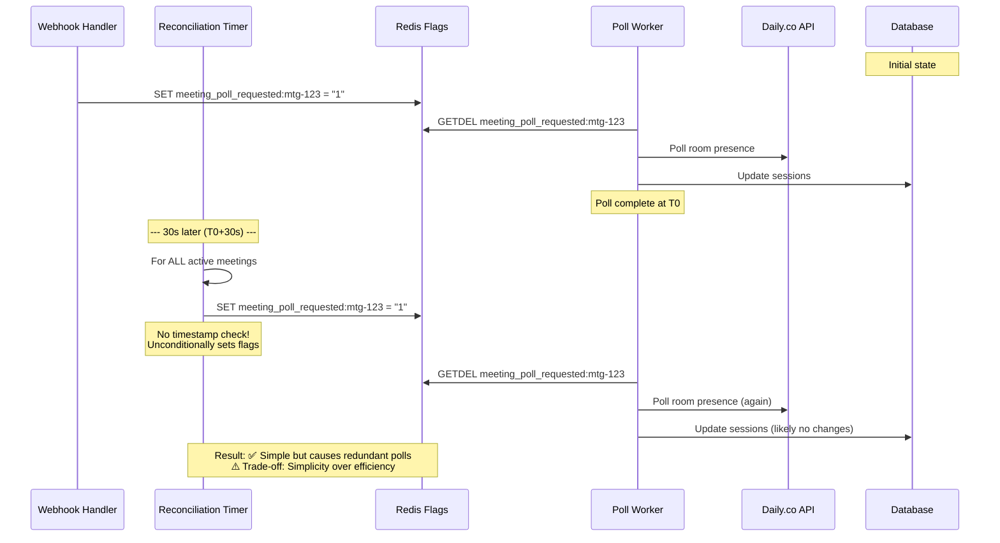

---

## Concurrent Polling Prevention

### Scenario 8: Two Workers See Same Poll Flag

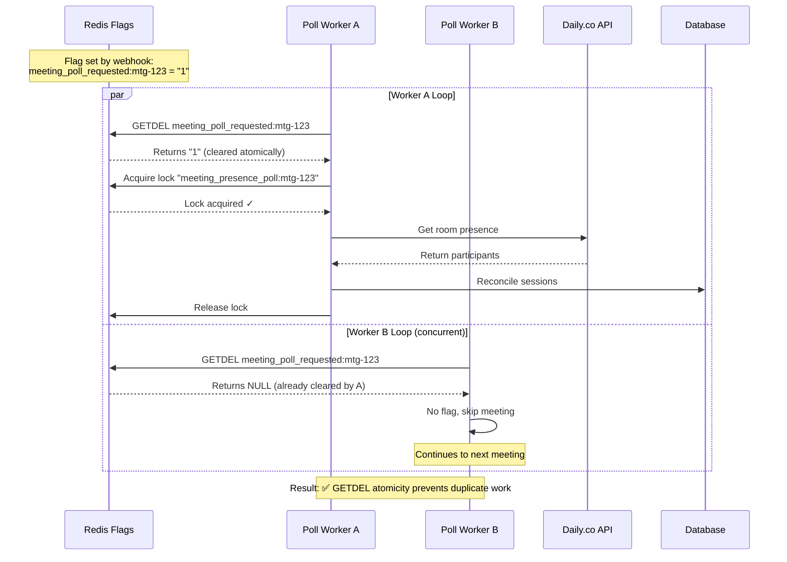

### Scenario 9: Two Workers Polling Different Meetings

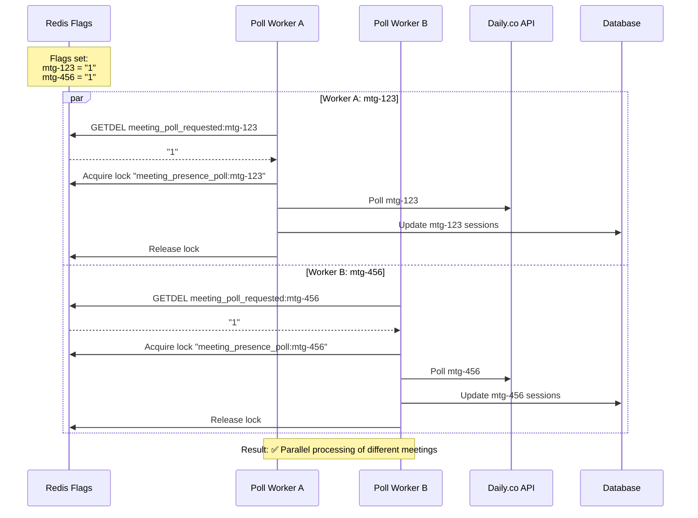

---

## Meeting Processing Lock

### Scenario 10: Process Meetings Overlap

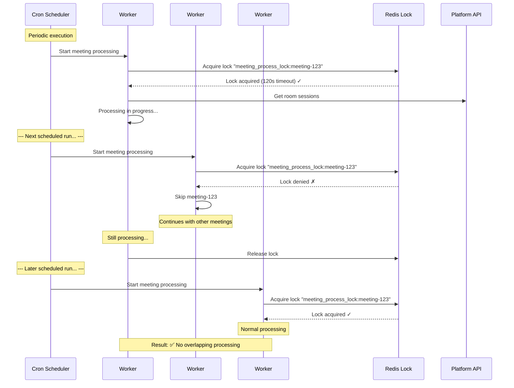

---

## Master Diagram: Event-Driven Architecture Flow

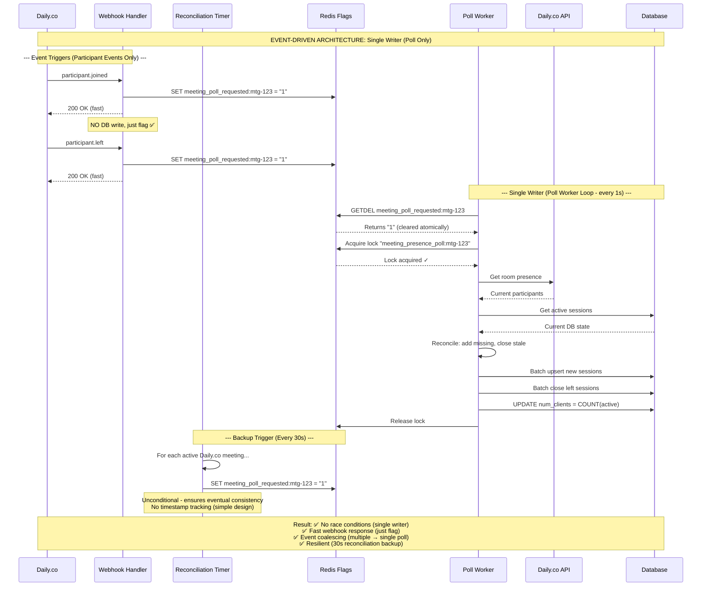

## Key Principles

1. **Single Writer** - Only poll worker writes to DB (eliminates all race conditions)
2. **Event Triggers** - Participant webhooks + reconciliation timer set poll flags
3. **Fast Participant Webhooks** - Just SET flag in Redis, return immediately
4. **Atomic Flag Operations** - `GETDEL` ensures exactly-once processing
5. **Event Coalescing** - Multiple webhooks → single poll covers all changes
6. **Unconditional Reconciliation** - Timer sets flags for ALL active meetings every 30s (no timestamp tracking)
7. **DB as Source of Truth** - API state reconciled into DB, `num_clients` derived from final DB state
8. **Lock for Coordination** - Prevents concurrent polls, not webhook races

## Architecture Constraints

### Current Limitations

1. **Redundant Polls:** Reconciliation triggers polls every 30s regardless of recent webhook activity
2. **No Rate Limiting:** High-traffic meetings may generate frequent API calls
3. **Participant Events Only:** Recording webhooks still queue tasks directly (not using flag pattern)

### Operational Requirements

- **Poll worker must run continuously** - 1-5s loop interval
- **Reconciliation timer must run continuously** - 30s-5m interval
- **Redis must be available** - No fallback mechanism
- **Idempotent operations required** - Polls may execute redundantly
