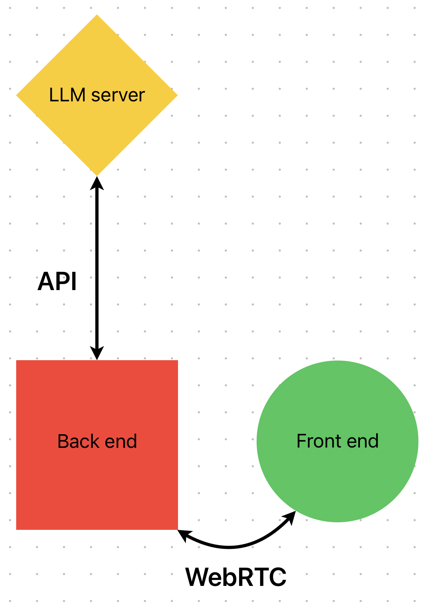

# Reflector React App

Reflector is a React application that uses WebRTC to stream audio from the browser to a server and receive live transcription and topics from the server.

## Table of Contents

- [Reflector React App](#reflector-react-app)
  - [Table of Contents](#table-of-contents)
  - [Project Architecture](#project-architecture)
  - [Installation](#installation)
  - [Run the Application](#run-the-application)
  - [WebRTC Integration](#webrtc-integration)
  - [OpenAPI Code Generation](#openapi-code-generation)
  - [Contribution Guidelines](#contribution-guidelines)

## Project Architecture



## Installation

To install the application, run:

```bash
yarn install
```

## Run the Application

To run the application in development mode, run:

```bash
yarn run dev
```

Then open [http://localhost:3000](http://localhost:3000) to view it in the browser.

## WebRTC Integration

The main part of the WebRTC integration is located in the `useWebRTC` hook in the `hooks/useWebRTC.js` file. This hook initiates a WebRTC connection when an audio stream is available, sends signal data to the server, and listens for data from the server.

To connect the application with your server, you need to implement the following:

1. **Signal Data Sending**: In the `useWebRTC` hook, when a `'signal'` event is emitted, the hook logs the signal data to the console. You should replace this logging with sending the data to the server:

```jsx
peer.on("signal", (data) => {
  // This is where you send the signal data to the server.
});
```

2. **Data Receiving**: The `useWebRTC` hook listens for `'data'` event and when it is emitted, it sets the received data to the `data` state:

```jsx
peer.on("data", (data) => {
  // Received data from the server.
  const serverData = JSON.parse(data.toString());
  setData(serverData);
});
```

The received data is expected to be a JSON object containing the live transcription and topics:

```json
{
  "transcription": "live transcription...",
  "topics": [
    { "title": "topic 1", "description": "description 1" },
    { "title": "topic 2", "description": "description 2" }
    // ...
  ]
}
```

This data is then returned from the `useWebRTC` hook and can be used in your components.

## OpenAPI Code Generation

To generate the TypeScript files from the openapi.json file, make sure the python server is running, then run:

```
openapi-generator-cli generate -i http://localhost:1250/openapi.json -g typescript-fetch -o app/api
```

You may need to run `yarn global add @openapitools/openapi-generator-cli` first. You also need a Java runtime installed on your machine.

## Contribution Guidelines

All new contributions should be made in a separate branch. Before any code is merged into `master`, it requires a code review.
